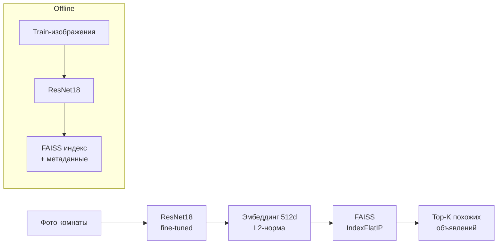

# 🏠 RealEstate Vision

[](https://github.com/olegg083/realestate-vision/actions/workflows/ci.yml)

Визуальный поиск похожих квартир по фотографии комнаты. Пользователь загружает фото (кухня, спальня, ванная и т.д.), сервис находит в базе объявлений комнаты с наиболее похожим интерьером.

**Стек:** PyTorch · torchvision (ResNet18) · FAISS · FastAPI · Streamlit · Docker · GitHub Actions

## Как это работает



1. **Классификатор.** ResNet18, предобученный на ImageNet, дообучается классифицировать 5 типов комнат. Это нужно, чтобы эмбеддинги отражали признаки интерьера, а не общие признаки ImageNet.
2. **Эмбеддинги.** С сети снимается последний `fc`-слой, выход global average pooling (512 чисел) L2-нормируется.
3. **Поиск.** Нормированные векторы лежат в `faiss.IndexFlatIP`. Скалярное произведение нормированных векторов равно косинусному сходству.
4. **Сервис.** FastAPI принимает изображение и возвращает top-K объектов с метаданными. Streamlit служит веб-интерфейсом поверх API.

## Данные

[MIT Indoor Scenes (indoorCVPR_09)](https://web.mit.edu/torralba/www/indoor.html). Используются 5 классов: `bathroom`, `bedroom`, `dining_room`, `kitchen`, `livingroom`. Каждый класс разбит на train/val/test в пропорции 70/15/15.

| Класс | Train | Val | Test |
|---|---:|---:|---:|
| bathroom | 137 | 29 | 31 |
| bedroom | 463 | 99 | 100 |
| dining_room | 191 | 41 | 42 |
| kitchen | 513 | 110 | 111 |
| livingroom | 494 | 105 | 107 |

> ⚠️ Цены, площади и число комнат в `metadata.json` **синтетические** (генерируются с фиксированным seed). В исходном датасете есть только изображения.

## Результаты

Классификация типа комнаты на test-выборке (391 изображение):

| Модель | Accuracy | Macro-F1 |
|---|---:|---:|
| Baseline: замороженный backbone, обучается только `fc` | 80.31% | 0.794 |
| Fine-tuning: `layer4` + `fc` | **84.40%** | **0.838** |

Самые трудные классы — `dining_room` (F1 0.756) и `livingroom` (F1 0.785): на open-space фотографиях в кадре часто есть и обеденная, и гостиная зона. Лучше всего распознаются кухни (F1 0.930) и ванные (F1 0.885). Confusion matrix и примеры ошибок — в [`notebooks/02_training_analysis.ipynb`](notebooks/02_training_analysis.ipynb).

После запуска `src.train` актуальные метрики сохраняются в `models/metrics.json`.

### Качество поиска

Классификатор обучался на accuracy, но продукт — это поиск, поэтому он оценивается отдельно (`python -m src.evaluate_retrieval`):

- база поиска — train (1798 изображений), запросы — test (391);
- результат релевантен, если тип комнаты совпадает с запросом;
- метрики: Precision@K и mAP@K.

| Энкодер | P@1 | P@5 | P@10 | mAP@10 |
|---|---:|---:|---:|---:|
| ResNet18 (ImageNet, без дообучения) | 0.757 | 0.686 | 0.662 | 0.570 |
| ResNet18 (fine-tuned) — **используется в сервисе** | 0.839 | 0.817 | 0.809 | 0.767 |
| CLIP ViT-B/32 (zero-shot) | **0.885** | **0.857** | **0.834** | **0.779** |

**Выводы.**
- Fine-tuning заметно улучшает эмбеддинги для поиска: +13.1 п.п. P@5 и +19.8 п.п. mAP@10 относительно весов ImageNet. У ImageNet-модели качество быстро падает с ростом K, у дообученной почти нет — классы образуют плотные кластеры.
- Zero-shot CLIP лучше по всем метрикам, но разрыв сокращается с ростом K: +4.6 п.п. P@1, +4.0 п.п. P@5, +1.2 п.п. mAP@10.
- В сервисе оставлен fine-tuned ResNet18: он в ~7.5 раза меньше по параметрам (11.7 млн против ~88 млн у image-энкодера ViT-B/32) и в ~2.5 раза легче по вычислениям (1.8 против 4.4 GFLOPs) — это важно для инференса на CPU. CLIP — первый кандидат на замену, если позволят ресурсы; дополнительно он даёт поиск по текстовому описанию.

Разбор результатов, t-SNE эмбеддингов и примеры выдачи — в [`notebooks/03_embeddings_and_search.ipynb`](notebooks/03_embeddings_and_search.ipynb).

## Ноутбуки

Весь пайплайн запускается скриптами из `src/`. Ноутбуки ничего не обучают: они импортируют код из `src` и анализируют результаты.

| Ноутбук | Содержание |
|---|---|
| [`01_eda`](notebooks/01_eda.ipynb) | Распределение классов, примеры, размеры и форматы изображений |
| [`02_training_analysis`](notebooks/02_training_analysis.ipynb) | Кривые обучения, метрики на test, confusion matrix, разбор ошибок |
| [`03_embeddings_and_search`](notebooks/03_embeddings_and_search.ipynb) | Сравнение энкодеров для поиска, t-SNE, демо выдачи |

## Структура проекта

```
├── src/                 # ML-пайплайн
│   ├── config.py        # пути, классы, гиперпараметры
│   ├── transforms.py    # аугментации и препроцессинг
│   ├── model.py         # ResNet18, загрузка весов, извлечение эмбеддингов
│   ├── prepare_data.py  # разбиение датасета на train/val/test
│   ├── train.py         # baseline -> fine-tuning, оценка на test
│   ├── build_index.py   # эмбеддинги базы + FAISS индекс + метаданные
│   ├── evaluate_retrieval.py  # Precision@K / mAP@K для разных энкодеров
│   ├── search.py        # поисковый движок: классификация + FAISS + фильтры
│   └── download_models.py     # скачивание весов из GitHub Release
├── api/main.py          # FastAPI: /search, /health, /images
├── tests/               # тесты API
├── app/streamlit_app.py # веб-интерфейс
├── docker/              # Dockerfile для API и интерфейса
├── docker-compose.yml
├── .github/workflows/   # CI: ruff + pytest
├── notebooks/           # EDA и анализ результатов
├── data/                # (не в git) raw и processed изображения
└── models/              # (не в git) веса, индекс, метаданные
```

## Запуск

Требуется Python 3.10+.

```bash
python -m venv venv
venv\Scripts\activate            # Windows
# source venv/bin/activate       # Linux / macOS
pip install -r requirements.txt  # для ноутбуков: requirements-dev.txt
```

**1. Данные.** Скачайте датасет и распакуйте так, чтобы получился путь `data/raw/indoorCVPR_09/Images/<класс>/*.jpg`. Затем:

```bash
python -m src.prepare_data
```

**2. Модель.** Все команды выполняются из корня репозитория. Можно скачать готовые веса и индекс из [релиза](https://github.com/olegg083/realestate-vision/releases/tag/v1.0):

```bash
python -m src.download_models
```

Или обучить самостоятельно (на GPU около 8 минут). Для GPU сначала установите PyTorch с CUDA по инструкции с [pytorch.org](https://pytorch.org/get-started/locally/), затем остальные зависимости.

```bash
python -m src.train
python -m src.build_index
python -m src.evaluate_retrieval   # нужен open_clip_torch из requirements-dev.txt, либо флаг --no-clip
```

**3. Сервис в Docker.** Нужны заполненные `models/` и `data/processed/`: они подключаются в контейнер как volume.

```bash
docker compose up --build
```

**3'. Сервис без Docker.** API и интерфейс запускаются в двух терминалах:

```bash
uvicorn api.main:app --port 8000
streamlit run app/streamlit_app.py
```

Интерфейс откроется на http://localhost:8501, Swagger API доступен на http://localhost:8000/docs.

Адрес API для интерфейса задаётся переменной окружения `API_URL` (по умолчанию `http://127.0.0.1:8000`).

## API

| Метод | Путь | Описание |
|---|---|---|
| `POST` | `/search` | Поиск похожих объектов по фото |
| `GET` | `/health` | Статус сервиса и размер индекса |
| `GET` | `/images/{path}` | Фотографии объектов из базы |

Параметры `/search`: `file` — изображение (JPEG, PNG или WebP, до 10 МБ), `k` — число результатов (1–50, по умолчанию 5). Необязательные фильтры: `room_type`, `min_price`, `max_price`, `rooms`.

```bash
curl -X POST "http://localhost:8000/search?k=3&room_type=kitchen&max_price=20" -F "file=@kitchen.jpg;type=image/jpeg"
```

Пример ответа (значения условные):

```json
{
  "query_room": {"room_type": "kitchen", "confidence": 0.94},
  "results": [
    {
      "similarity_score": 0.871,
      "image_url": "http://localhost:8000/images/train/kitchen/int474.jpg",
      "apartment": {"apartment_id": "APT-00812", "image_path": "train/kitchen/int474.jpg",
                    "room_type": "kitchen", "price_mln": 14.2, "area_sqm": 64, "rooms": 2}
    }
  ]
}
```

Кроме поиска соседей, модель возвращает тип комнаты на запросе (`query_room`): голова классификатора работает поверх того же прохода backbone, так что это не требует дополнительных вычислений.

Ошибки возвращаются с понятными кодами: `400` — файл не читается как изображение, `413` — файл слишком большой, `415` — неподдерживаемый формат, `422` — неверные параметры.

## Тесты

```bash
pytest
```

Тесты API подменяют поисковый движок фейковым, поэтому не требуют обученной модели и работают без GPU.
